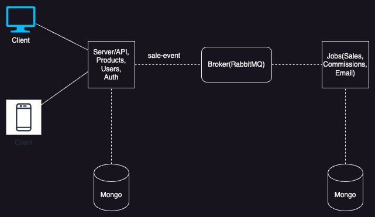
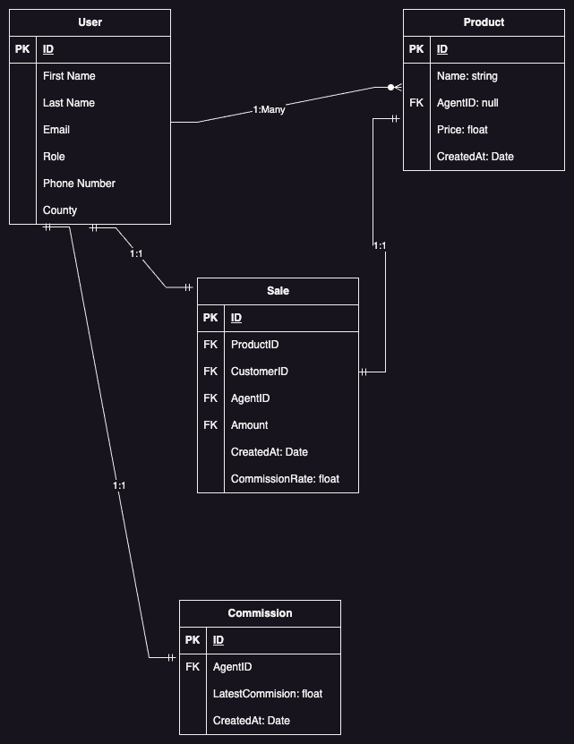

# Sales_Tracking
comprehensive sales tracking system that enables sales agents to record sales, calculate commissions, and receive email notifications containing statements of their sales within a requested period.

## Dependencies
To install and run the application locally, make sure to have the following dependencies:

1. Docker ~25.0.3
2. Register an API key with Mailchimp.

## Installation

Make sure docker is up and running. Go to your command line and execute the following instructions:
1. Create an `.env` with the following keys:
  ```
  JOBS_CONN_STR_LOCAL="mongodb://sales_database:27017/inc_olap"
  DB_PASSWORD="some_password"
  DB_USER="some_username"
  CONN_STR_LOCAL="mongodb://server_oltp_database:27017/inc_oltp"
  JWT_SECRET="some_secret"
  NODE_ENV="development"
  JWT_EXPIRY="1d"
  BROKER_URL="amqp://rabbitmq_broker:5672"
  MAILCHIMP_API_KEY="<YOUR MAILCHIMP_API_KEY>"
  FROM_EMAIL="<YOUR email sending domain e.g bruce@yourdomain.com>"
  ```
2. `$ git clone git@github.com:JayKay24/Sales_Tracking.git`
3. `$ cd Sales_Tracking`
4. `$ docker-compose up`

To shut down the application, run `docker-compose down` in the root directory of the project.

## Architecture

The application uses a microservices arechitecture and splits the workload into two categories:

1. OLTP - These are the day to day transactional requests that the users will make to the application e.g registration, buying a product etc.
2. OLAP - These are the background jobs required to fulfill application requirments that will require long-running calculations e.g calculating agent
  commissions and unpaid commissions within a given date range, sending emails to agents etc.

### Diagrams
#### Backend


#### Entity relationship diagram across all services


## Testing
To run the tests locally, navigate to the root directoy and run `npx lerna run test`.